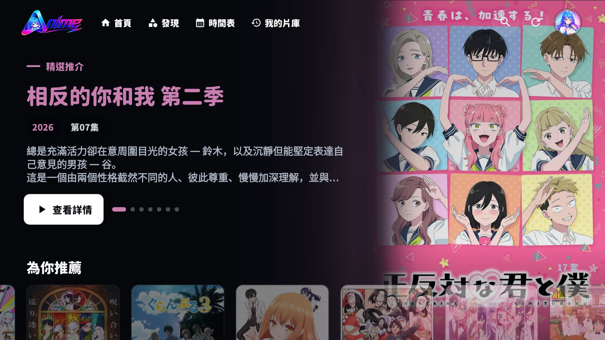
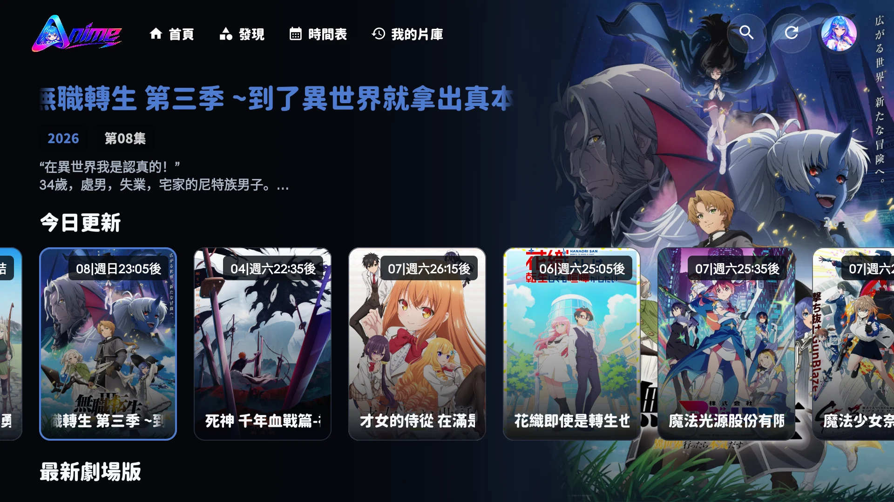
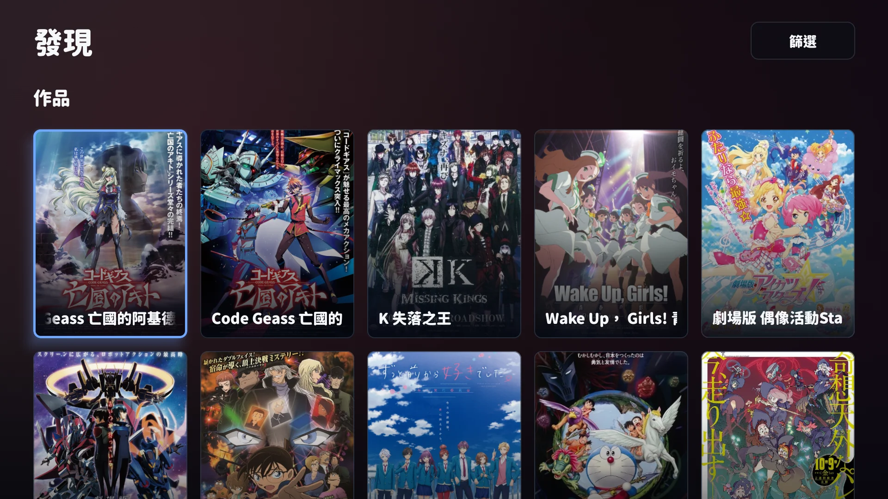
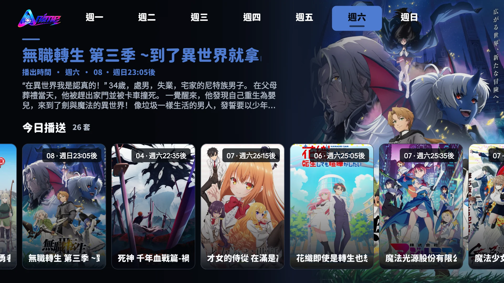
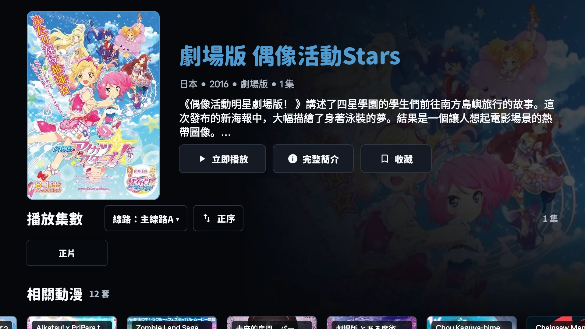
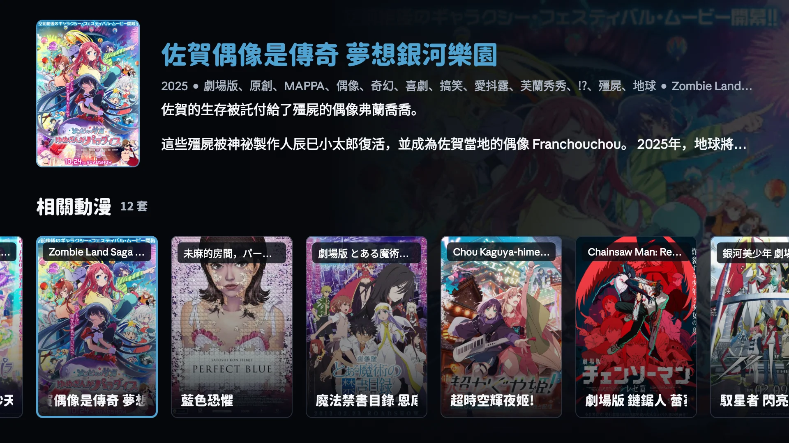
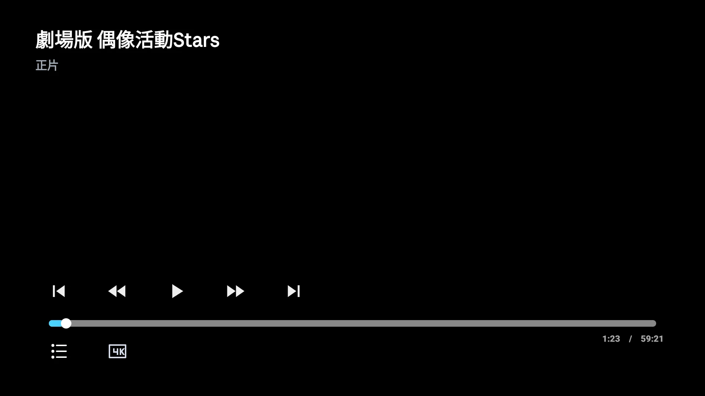

# Aulama Anime TV — Android TV / Google TV 動漫 App

**繁體中文** · [廣東話](./README.yue-Hant.md) · [简体中文](./README.zh-CN.md)

  

<strong>大螢幕上的動漫，從搜尋到播放都更從容。</strong>

  
  
  
  

**Aulama Anime TV** 以 Android TV／Google TV 的遙控器操作、客廳觀看距離與橫向大螢幕為設計核心。搜尋作品、選擇集數、切換多條播放線路、續播與跳過片頭片尾，皆可透過 D-pad 完成。

> **跳過片頭與片尾，享受 Netflix 式的直覺體驗。** Aulama Anime TV 獨家整合片頭與片尾時間資料，在適當時機顯示一鍵跳過按鈕；長按遙控器 **OK／確認鍵** 可暫時以 **2×** 播放，放開後立即回復正常速度。

> 如果 Aulama Anime TV 讓電視追番更方便，歡迎在 GitHub 按下 **Star**。您的支持會幫助更多用戶找到本專案，也為後續改善帶來動力。

[下載正式版](https://github.com/siumiu1968/AulamaAnime_TV/releases/latest)　·　[下載搶先版](https://github.com/siumiu1968/AulamaAnime_TV/releases/tag/v3.2.0-beta.1)　·　[查看全部版本](https://github.com/siumiu1968/AulamaAnime_TV/releases)

## 實際畫面

以下皆為 Android TV 實機介面截圖，沒有重新繪製裝置外框。

| 首頁精選推介 | 首頁今日更新 |
| --- | --- |
|  |  |

| 發現片庫 | 時間表 |
| --- | --- |
|  |  |

| 我的片庫 | 作品詳情與選集 |
| --- | --- |
|  |  |

| 相關動漫預覽 | 播放器控制列 |
| --- | --- |
|  |  |

## 核心功能

### 更完整的中文搜尋

- 共用網站搜尋邏輯，支援模糊字詞、別名、繁簡名稱與日文原名。
- API 暫時失效時會退回本機舊搜尋，避免搜尋功能直接中斷。
- 搜尋結果集中呈現作品，不混入無關推薦。

### 一鍵跳過與兩倍速播放

- 獨家整合片頭與片尾時間資料，提供與 Netflix 同樣直覺的一鍵跳過體驗。
- 跳過按鈕只在適當時機顯示；閒置後自動收起，按下遙控器即可再次喚醒。
- 長按遙控器 **OK／確認鍵** 可暫時以 **2×** 播放，放開後立即回復原來速度。

### 多線路播放與自動回退

- 詳情頁會按作品顯示多條可用播放線路；播放失敗時可切換其他線路。
- 支援 HLS、播放進度、續播、下一集，以及可用來源自動回退。
- 已排除已停用的白底黑字舊播放來源。

### 為遙控器而設計

- 焦點位置、返回路徑、按鈕尺寸與選集排列皆針對 Android TV／Google TV D-pad。
- 長標題會依可用空間調整字級與換行，不再只顯示省略號。
- 深色介面、完整比例海報與低干擾播放控制，適合客廳觀看距離。

### 遊客模式與跨裝置同步

- 免登入即可搜尋與播放；記錄及收藏保留於本機。
- 登入 Aulama ID 後，可跨裝置同步收藏、觀看進度與個人資料。
- 介面會跟隨系統使用繁體中文或簡體中文，也可在用戶卡片切換。

### 更可靠的應用程式更新

- 正式版與搶先版兩個更新通道，可在用戶卡片一鍵切換。
- 更新視窗預設聚焦「下載更新」，開啟後即可使用遙控器操作。
- 下載設有逾時、失敗提示與重新嘗試，避免長時間停留在 0%。

## 下載

| 通道 | 適合對象 | 下載 |
| --- | --- | --- |
| 正式版 `3.1.0` | 希望使用完成測試、變動較少的版本 | [下載最新正式版](https://github.com/siumiu1968/AulamaAnime_TV/releases/latest) |
| 搶先版 `3.2.0-beta.1` | 願意提早測試新功能並回報問題 | [下載 Beta 1](https://github.com/siumiu1968/AulamaAnime_TV/releases/tag/v3.2.0-beta.1) |

支援 **Android TV、Google TV、Android 電視盒子**，最低版本為 **Android 5.0（API 21）**。

## 安裝與基本操作

1. 從上方下載對應通道的 APK。
2. 將 APK 傳送至電視，允許該檔案管理器安裝未知來源應用程式。
3. 安裝完成後，從 TV Apps 開啟 Aulama Anime TV。
4. 可直接使用遊客模式，或登入 Aulama ID 同步資料。

| 遙控器 | 功能 |
| --- | --- |
| 上／下／左／右 | 移動焦點、瀏覽卡片與集數 |
| OK／確認 | 開啟目前項目 |
| 長按 OK／確認（播放中） | 暫時以 2× 播放；放開後回復正常速度 |
| 返回 | 關閉卡片或返回上一頁 |
| 播放器方向鍵 | 喚醒控制列、選擇跳過／下一集操作 |

## 專案原則

- **TV first**：優先照顧遙控器、焦點與十呎觀看體驗。
- **如實呈現資料**：來源未提供的年份、集數或狀態，不會自行推測。
- **安全回退**：搜尋、線路與更新服務失效時，盡量保留可用功能。
- **不託管影片**：作品資料與播放可用性會受到第三方來源、網路及地區限制影響。

## 問題回報

回報時請附上 TV 型號、Android 版本、App 版本、作品／集數、所選線路，以及可重現問題的步驟。請勿公開登入憑證或私人資料。

[建立 Issue](https://github.com/siumiu1968/AulamaAnime_TV/issues/new)　·　[查看 Releases](https://github.com/siumiu1968/AulamaAnime_TV/releases)

## 致謝

本專案參考並延伸 [peacefulprogram/sakura-animation](https://github.com/peacefulprogram/sakura-animation)，並針對 Aulama 品牌介面、中文搜尋、來源協調、播放穩定性與 Android TV 遙控操作持續調整。

---

若 Aulama Anime TV 對您有所幫助，按下一顆 **Star** 就是最直接的支持，也能讓更多想在 Android TV／Google TV 觀看動漫的用戶找到本專案。
